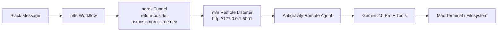

# 🚀 Antigravity Remote Developer Engine (n8n + Slack Automation)

An autonomous AI Software & Systems Engineering agent running locally on Mac, powered by **Gemini Pro** with tool execution capabilities. It listens for Slack commands via **n8n** and **ngrok**, executing terminal commands, creating projects, editing code, and reporting status back to Slack.

---

## 🏗️ System Architecture



---

## ⚡ Quick Endpoints Reference

| Method | Path | Description | Example Response |
| :--- | :--- | :--- | :--- |
| `GET` | `/` | Health check endpoint returning status & funny wake-up message. | `{"status": "ONLINE", "message": "☕ Fully caffeinated...", "port": 5001}` |
| `POST` | `/` | Primary payload handler for n8n / Slack instructions. | `{"status": "SUCCESS", "output": "*System Status: Active*..."}` |

---

## 📦 Prerequisites & Requirements

- **Python 3.10+** (with virtual environment in `.venv/`)
- **Dependencies**: Listed in [requirements.txt](file:///Users/thomaswu/Desktop/n8n_automation/requirements.txt)
  - `google-genai`
  - `requests`
  - `httpx`
  - `pydantic`
- **ngrok CLI**: Tunneling daemon configured with static domain `refute-puzzle-osmosis.ngrok-free.dev`.
- **Environment Variables**: `GEMINI_API_KEY` set in shell or launchd service.

---

## ⚙️ macOS `launchd` Auto-Startup Setup

Run the setup script to generate and load the background services automatically:

```bash
chmod +x setup_launchd.sh
./setup_launchd.sh
```

This creates and loads two LaunchAgents:
1. **Python Listener Service**: `~/Library/LaunchAgents/com.thomaswu.n8n-remote-listener.plist`
2. **ngrok Tunnel Service**: `~/Library/LaunchAgents/com.thomaswu.ngrok-tunnel.plist`

### Useful Management Commands

- **Check Service Status**:
  ```bash
  launchctl list | grep thomaswu
  ```
- **Reload Services**:
  ```bash
  launchctl unload ~/Library/LaunchAgents/com.thomaswu.n8n-remote-listener.plist
  launchctl load ~/Library/LaunchAgents/com.thomaswu.n8n-remote-listener.plist

  launchctl unload ~/Library/LaunchAgents/com.thomaswu.ngrok-tunnel.plist
  launchctl load ~/Library/LaunchAgents/com.thomaswu.ngrok-tunnel.plist
  ```

---

## 📂 Project Structure

- [antigravity_remote_agent.py](file:///Users/thomaswu/Desktop/n8n_automation/antigravity_remote_agent.py): Core Gemini agent loop, tool execution map, and HTTP server.
- [n8n_remote_listener.py](file:///Users/thomaswu/Desktop/n8n_automation/n8n_remote_listener.py): Entry point for background listener service.
- [remote_worker_n8n_workflow.json](file:///Users/thomaswu/Desktop/n8n_automation/remote_worker_n8n_workflow.json): n8n workflow definition for Slack triggers.
- [requirements.txt](file:///Users/thomaswu/Desktop/n8n_automation/requirements.txt): Python dependencies.
- [.gitignore](file:///Users/thomaswu/Desktop/n8n_automation/.gitignore): Files excluded from version control.
